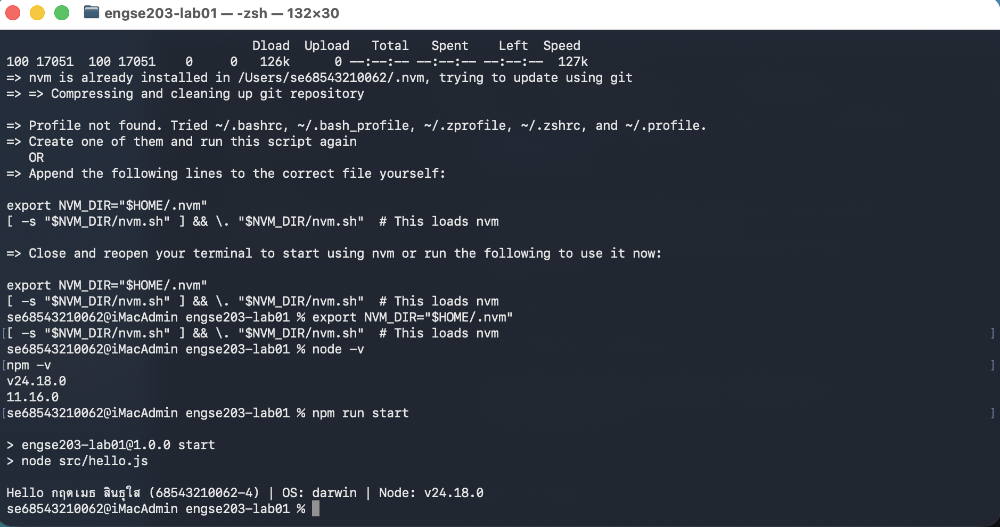

# ENGSE203 LAB XX — <ชื่องาน>

## ผู้จัดทำ

- ชื่อ-นามสกุล: กฤตเมธ สินธุใส
- รหัสนักศึกษา: 68543210062-4
- ระบบปฏิบัติการที่ใช้: macOS

## วัตถุประสงค์ของงาน

- ตรวจสอบและใช้ Node.js, npm, Visual Studio Code และ Git จาก Terminal ได้
- สร้างโครงงาน JavaScript ขนาดย่อม พร้อม package.json และ npm script
- รันโปรแกรม Node.js ที่แสดงชื่อ รหัสนักศึกษา OS และ Node.js version ได้
- สร้าง GitHub repository, commit, push และจัดทำ README เพื่อเป็นหลักฐานการเรียนรู้ได้

## เครื่องมือที่ใช้

- Code Editor: Visual Studio Code
- Runtime: Node.js v18.19.1 และ npm
- Version Control: macOS
- Git: บัญชี GitHub ที่ใช้งานได้
- Internet

## วิธีติดตั้งและรัน

โปรเจกต์นี้เริ่มต้นขึ้นมาบนระบบปฏิบัติการ macOS โดยมีขั้นตอนการดาวน์โหลดและเรียกใช้งานโปรแกรมตามลำดับดังนี้:

1. การเตรียมสภาพแวดล้อม (Prerequisites)

ก่อนทำการรันโปรเจกต์ ตรวจสอบให้แน่ใจว่าเครื่องของคุณได้ติดตั้ง Node.js และ npm เรียบร้อยแล้ว โดยสามารถตรวจสอบเวอร์ชันผ่าน Terminal ได้ด้วยคำสั่ง:

node -v  # เวอร์ชันที่ใช้ในแลปนี้คือ v18.19.1
npm -v   # เครื่องมือจัดการแพ็กเกจของ Node.js

2. การติดตั้ง Dependency (Installation)

เมื่อดาวน์โหลดหรือโคลนซอร์สโค้ดลงมายังเครื่องแล้ว ให้เปิด Terminal ภายในโฟลเดอร์โปรเจกต์ engse203-lab01 จากนั้นรันคำสั่งต่อไปนี้เพื่อดาวน์โหลดแพ็กเกจทั้งหมดที่ระบุไว้ในไฟล์ package.json:

npm install

3. การรันโปรแกรม (Execution)

หลังจากติดตั้ง Dependency เรียบร้อยแล้ว ให้รันคำสั่ง Script เพื่อให้ Node.js ประมวลผลไฟล์โค้ดหลัก (src/hello.js) และแสดงผลลัพธ์บนหน้าจอ:

npm run star

## โครงสร้างไฟล์

```text
.
engse203-lab01/
├── src/
│   └── hello.js
├── kkk.png
├── package.json
└── README.md
```

## หลักฐานผลลัพธ์

อเมื่อรันคำสั่ง `npm run start` ระบบจะแสดงชื่อ-นามสกุล รหัสนักศึกษา และเวอร์ชันของระบบปฏิบัติการอย่างถูกต้องใน Terminal ดังนี้:



## ปัญหาที่พบและวิธีแก้ไข

-  ปัญหาที่พบและวิธีแก้ไข

1. ปัญหา: รันคำสั่งพร้อมกันหลายบรรทัดและพิมพ์อีเมลผิด

รายละเอียด: ในระหว่างการใช้งาน ได้คัดลอกคำสั่งทั้งหมดมาวางใน Terminal พร้อมกัน ทำให้บางคำสั่งทำงานไม่ถูกต้อง อีกทั้งยังพิมพ์อีเมลผิดจาก gmail.com เป็น gamil.com ส่งผลให้ไม่สามารถอัปโหลดข้อมูลไปยัง GitHub ได้

วิธีแก้ไข: ลบการตั้งค่า remote origin เดิมออก แก้ไขอีเมลให้ถูกต้อง จากนั้นดำเนินการรันคำสั่งใหม่ทีละบรรทัดเพื่อหลีกเลี่ยงความผิดพลาด

2. ปัญหา: Permission denied (publickey)

รายละเอียด: ไม่สามารถ Push โค้ดขึ้น GitHub ได้ เนื่องจากเครื่องยังไม่ได้ตั้งค่าและยืนยันตัวตนผ่าน SSH Key ทำให้ระบบปฏิเสธการเชื่อมต่อ

วิธีแก้ไข: สร้าง SSH Key ใหม่ด้วยคำสั่ง ssh-keygen จากนั้นคัดลอก Public Key จากไฟล์ id_ed25519.pub ไปเพิ่มในหน้า GitHub Settings > SSH and GPG keys ของบัญชีผู้ใช้ เมื่อเพิ่มคีย์เรียบร้อยแล้วจึงสามารถเชื่อมต่อและ Push โค้ดขึ้น GitHub ได้ตามปกติ

## References & AI Assistance

- Source / Documentation: คู่มือปฏิบัติการวิชา ENGSE203 สัปดาห์ที่ 1
- AI tool used: ChatGPT
- Used for: ช่วยอธิบายความหมายของข้อความ Error ตรวจสอบความถูกต้องของคำสั่ง และแนะนำขั้นตอนการแก้ไขปัญหาการเชื่อมต่อ SSH Key กับ GitHub รวมถึงการปรับเอกสารให้เหมาะสมกับการใช้งานบน macOS
- My adaptation: นำคำแนะนำจาก AI มาปรับใช้โดยตรวจสอบและรันคำสั่งทีละบรรทัด แก้ไขข้อผิดพลาดที่พบ และทดสอบจนสามารถเชื่อมต่อกับ GitHub และ Push โค้ดขึ้นรีโมตรีโพซิทอรีได้สำเร็จ# engse203-lab01--68543210062-4-
