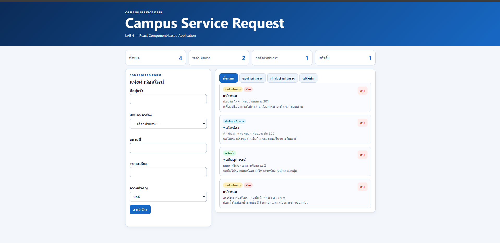
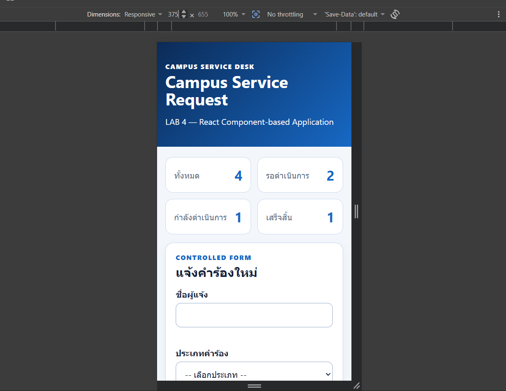
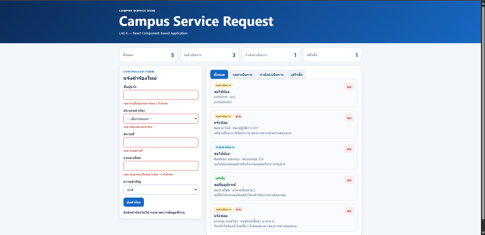
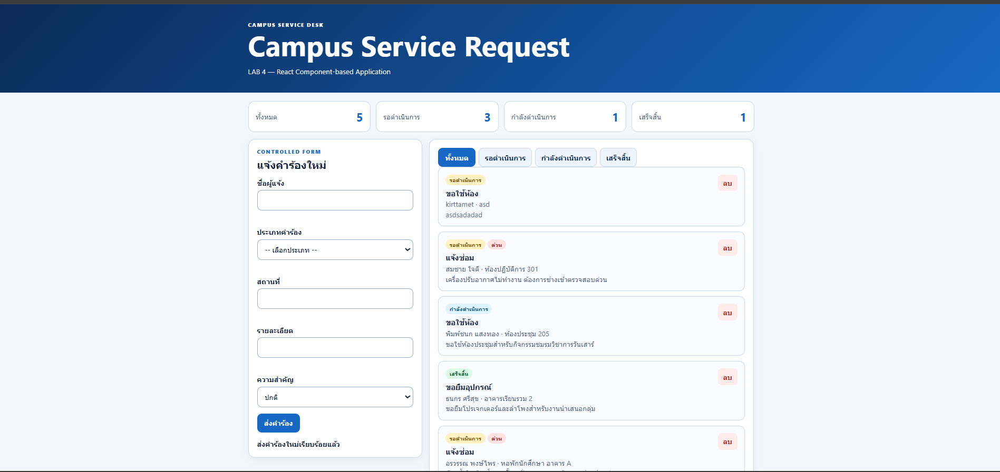

# LAB 4 Evidence

เก็บภาพที่ไม่เปิดเผยข้อมูลส่วนบุคคลเกินจำเป็น เช่น:

- `desktop.png`

- `mobile-375.png`

- `validation.png`

- `empty-state.png`

- `pages-incognito.png`

เชื่อมชื่อไฟล์เหล่านี้ใน README หลักของ repository นักศึกษา

