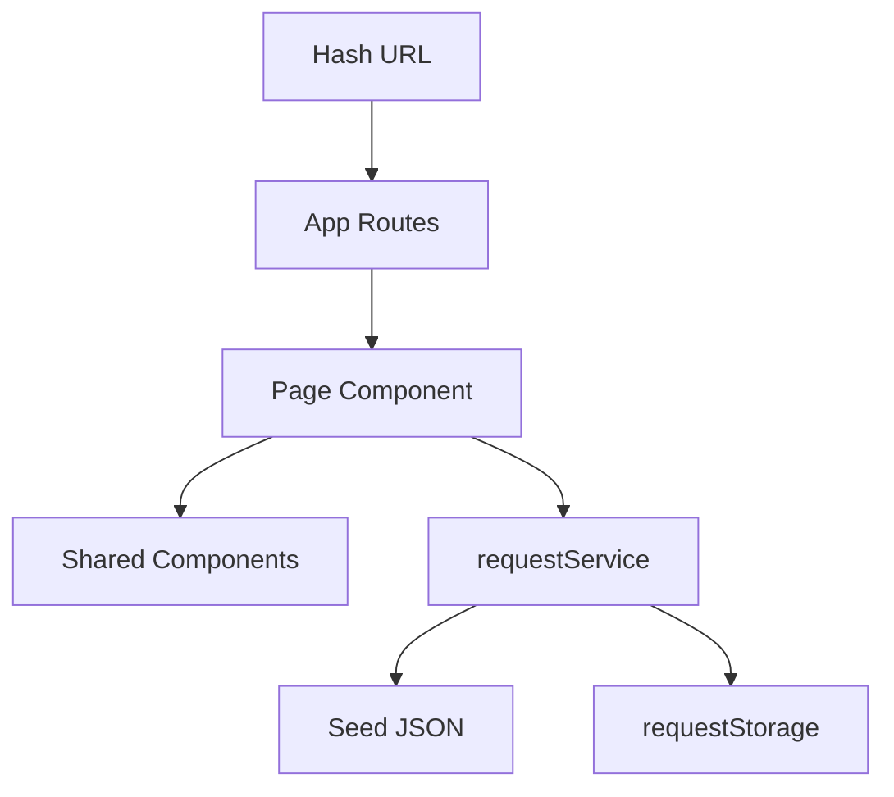

# ENGSE203 LAB05 — Campus Service Request

การบ้าน Lab 05 วิชา ENGSE203: ต่อยอด Campus Service Request ให้อ่าน/เขียนคำร้องผ่าน Service Layer และเก็บข้อมูลด้วย localStorage

## Run

```bash
npm ci
npm run dev
npm run check
npm run build
npm run preview
```

## Architecture



- `App.jsx` กำหนด route matrix ของแอป
- `pages/` ถือ state และ lifecycle เฉพาะของแต่ละ route
- `components/` เป็น presentational component รับข้อมูล/handler ผ่าน props
- `requestService.js` เป็นจุดเดียวที่เรียก `fetch`
- `requestStorage.js` เป็นจุดเดียวที่แตะ `localStorage`

## Effect reasoning

Effect ของ Dashboard และหน้ารายละเอียดขึ้นกับ `scenario`/`requestId` และ `reloadKey` เพราะค่าทั้งสองเป็นตัวกำหนดว่าต้อง fetch ข้อมูลชุดใหม่จาก Service เมื่อไร ส่วน summary และรายการที่กรองแล้วคำนวณจาก state ระหว่าง render จึงไม่ต้องอยู่ใน Effect ทุก Effect มี cleanup guard (`ignore`) เพื่อไม่ให้ผลลัพธ์ async เก่าที่ยังไม่เสร็จมาตั้งค่า state ทับ หลังจาก route หรือ scenario เปลี่ยนไปแล้ว

## Privacy

ใช้ข้อมูลจำลองเท่านั้น ห้ามบันทึก token, password, secret หรือข้อมูลส่วนบุคคลจริงลงใน `localStorage` หรือภาพหลักฐาน
